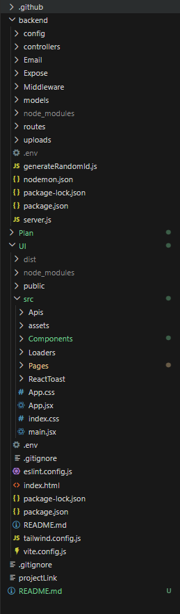
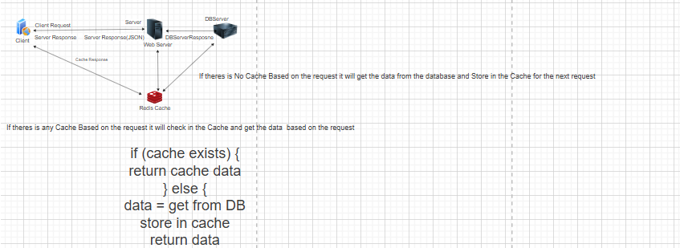

# 🎓 College Learning Management System (LMS)

**A College Learning Management System (LMS)** built using the **MERN Stack**, currently under active development, that allows **administrators**, **instructors**, and **students** to manage courses, track **attendance**, apply for leave, and interact through a structured academic platform.

This project demonstrates a **role-based dashboard** system with a **modern UI** and **real-world LMS functionalities**, and is **still in progress with ongoing feature enhancements and improvement**s.

------------------------------------------------------------------------

## 🔐 Role-Based Access Control (RBAC)

This system follows a **role-based access control** model where different users have different permissions and capabilities.

### 📊 Access Table

| Feature / Use Case | 👨‍🎓 Student | 👨‍🏫 Teacher | 👨‍💼 Admin |
|--------------------|--------------|--------------|------------|
| View Courses | ✅ Yes | ✅ Yes | ✅ Yes |
| Access Course PDFs | ✅ Yes | ✅ Upload & Manage | ✅ Yes |
| Take Tests / Exams | ✅ Yes | ✅ Create / Edit / Delete | ❌ No |
| View Attendance | ✅ Yes | ✅ Yes | ✅ Yes |
| Mark Attendance | ❌ No | ✅ Yes | ❌ No |
| Send Attendance Reminder | ❌ No | ✅ Yes | ❌ No |
| Apply for Leave | ❌ No | ✅ Yes | ❌ No |
| Approve / Reject Leave | ❌ No | ❌ No | ✅ Yes |
| Profile View | ✅ Yes | ✅ Yes | ✅ Yes |
| Profile Update | ✅ Yes | ✅ Yes | ✅ Yes |
| Upload Study Materials | ❌ No | ✅ Yes | ❌ No |
| View Marks | ✅ Yes | ✅ Yes | ✅ Yes |
| Add / Update Marks | ❌ No | ✅ Yes | ❌ No |
| Publish Marks | ❌ No | ✅ Yes | ❌ No |
| Download Mark Report | ✅ Yes | ✅ Yes | ✅ Yes |
| Manage Subjects | ❌ No | ❌ No | ✅ Yes |
| Assign Subjects | ❌ No | ❌ No | ✅ Yes |
| Manage Users | ❌ No | ❌ No | ✅ Yes |
| Account Deactivation | ❌ No | ❌ No | ✅ Yes |
| Notifications (Create) | ❌ No | 🚧 Optional | ✅ Yes |
| Notifications (View) | ✅ Yes | ✅ Yes | ✅ Yes |
| CRUD Operations | ❌ No | ✅ Assigned Data Only | ✅ Full |
| Maintenance Mode | ❌ No | ❌ No | 🚧 Upcoming |
| User Status (Online / Offline) | ✅ Yes | ✅ Yes | ✅ Yes |
| Profile Activity Notifications | 🚧 Upcoming | 🚧 Upcoming | 🚧 Upcoming |

---

### 👨‍🎓 Student

- Can **view courses and access PDFs**
- Can **take exams based on enrolled courses**
- Can **view attendance records**
- Can **update profile information**

---

### 👨‍🏫 Teacher

- Can **mark and manage student attendance**
- Can **send attendance reminders via email**
- Can **upload course materials (PDFs)**
- Can **create and update profile**
- Can **handle student academic activities**

---

### 👨‍💼 Admin

- Can **add and manage subjects**
- Can **assign subjects to teachers**
- Can **activate/deactivate teacher accounts**
- Can **create and manage notifications**
- Can perform **full CRUD operations**
- 🚧 **Maintenance mode feature coming soon**

---

## 📝 Leave Management System (Advanced Feature)

- Only **Teachers** can create leave requests
- Leave form includes:
  - From Date
  - To Date
  - Total Days (auto-calculated)
  - Leave Type
  - Description
  - Recipient Email

### 🔄 Workflow

1. Teacher submits leave request
2. 📧 Email is sent to the specified recipient
3. Default status: **In Progress**
4. Recipient can:
   - ✅ Approve
   - ❌ Reject

5. Teacher/Admin can update status:
   - Approved
   - Rejected
   - In Progress

6. 📩 On status update:
   - Email notification is sent again to the requester

---

## ⚡ Upcoming Enhancement

- 🚀 Real-time updates using **WebSockets (Socket.io)**
  - Instant leave status updates
  - Live notifications without refresh

------------------------------------------------------------------------

## 🚀 Features

### 🔐 Authentication & Roles

-   Role-based login system
-   Admin, Instructor, and Student access
-   Secure authentication flow
-   Protected routes

------------------------------------------------------------------------

### 👨‍💼 Admin Dashboard

-   Manage teachers
-   Manage students
-   Assign subjects to teachers
-   Activate / deactivate user accounts
-   Monitor platform users

------------------------------------------------------------------------

### 👨‍🏫 Instructor Features

-   Editable instructor profile
-   Upload and manage courses
-   View assigned subjects
-   Track student attendance
-   Manage student leave requests

------------------------------------------------------------------------

### 👨‍🎓 Student Features

-   View available courses
-   Check attendance
-   Access learning materials
-   Apply for leave

------------------------------------------------------------------------

### 📊 Attendance Management

-   Mark student attendance
-   "Mark All Present" option
-   Individual attendance toggle
-   Attendance summary dashboard

------------------------------------------------------------------------

### 📝 Leave Management System

-   Students can apply for leave
-   Admin / Instructor can approve or reject leave
-   Leave status tracking system

------------------------------------------------------------------------

### 📧 Email Integration

-   Email notifications for leave requests
-   System email communication
-   Automated notifications using **Nodemailer**

------------------------------------------------------------------------

### 📚 Course Management

-   Upload courses
-   Assign subjects
-   Manage course details
-   Student course access

------------------------------------------------------------------------

## 🛠 Tech Stack

### Frontend

-   React.js
-   TailwindCSS
-   React Router

### Backend

-   Node.js
-   Express.js

### Cache

-   Redis

### Database

-   MongoDB
-   Mongoose

### Email Service

-   Nodemailer

### Real Time Updates

-   Webscokets

------------------------------------------------------------------------

## 📂 Project Structure

----------------------------\--------------------------------------------
------------------------------------------------------------------------

##  Request Handling with Redis Caching

------------------------------------------------------------------------

## ⚙️ Installation

### 1. Clone the repository

\`\`\`bash git clone https://github.com/ravitharun/edu-lms-mern.git

## 📌 Future Improvements

📌 Future Improvements ⚡ Real-Time System

-- Implement WebSockets (Socket.io) for real-time communication
Live attendance updates

Instant notifications for students and instructors

Real-time announcements

🚀 Performance Optimization

Integrate Redis caching to improve API response speed

Cache frequently accessed data such as:

Courses

Student profiles

Instructor data

Dashboard statistics

Reduce database load using Redis

📢 Notifications System

Course announcements

Assignment reminders

Real-time alerts

📂 Learning Resources

File uploads for course materials

PDF / video / document support

📊 Student Analytics

Student progress tracking

Attendance analytics

Course completion insights

------------------------------------------------------------------------

## 👨‍💻 Author

**Ravi Tharun**

-   MERN Stack Developer
-   Passionate about building modern web applications

------------------------------------------------------------------------

⭐ If you like this project, consider giving it a **star on GitHub**.
